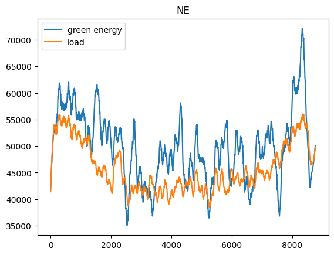

# SE-Europe-Data_Challenge_Template
Template repository to work with for the NUWE - Schneider Electric European Data Science Challenge in November 2023.

# Tokens:
- b5b8c21b-a637-4e17-a8fe-0d39a16aa849
- fb81432a-3853-4c30-a105-117c86a433ca
- 2334f370-0c85-405e-bb90-c022445bd273
- 1d9cd4bd-f8aa-476c-8cc1-3442dc91506d

# Running the Pipeline (Examples)

The individual steps can be run by commenting out the respective sections in the [run_pipeline.sh](./scripts/run_pipeline.sh) file. **All the parameters passed here are folder names, rather than specific a filename**. This will make it easier to dump all the necessary data at each state.

Run the following:
`sh scripts/run_pipeline.sh 2022-01-01 2023-01-01 data-raw data-processed models data-processed predictions`

# Repository

Practices:

- Requirements

- Best practices are followed by writing clean and efficient code (utilize numpy/TF ops whereever possible).

- The code is typed to provide documentation and type hints.

- All the configs and hyperparams go under [config](./src/config.py).

- All the constatns are defiend in [constants](./src/constants.py).

# Documentation

# Data Anlysis

Exploring the data can reveal key information that can aid in the design of the machine learning model.

code can be found in: [notebook](./src/data_analysis.ipynb)

## Facts

### Patterns

We can visualize the general trends in the data my looking at the smoothed version date to get rid of the noise and see the underlyng patterns.

We see that on an absolute scale, some countries are far behind on meeting their energy consumption requirements soley by green energy sources. Eg. Hungary, Poland

While others seem to do a far better job. Eg: Sweden, Netherlands, Spain

Thus we can expect the model to favour these countries.

### Autocorrelation

The autocorrelation of a signal is simply the correlation of the signal with a lagged copy of itself.
For a timeseries data, the metric can be useful to select a window for analysis, for instance the time window for a LSTM model.

The correlation appears to drop significantly until a lag of 10 and there appears to be some form of periodicity after that (which might be redundant). Thus, we can choose a window of size 10-15. Since the data is seperated by 1 hr interval, this makes sense, as we can expect the energy patterns to be quite similar every day (~24 hrs).

## Data Processing

The ingested dataset was observed to have missing values. But since the precision of measurement is 15 mins, we can expect the real-world values to be quite similar in the window, a nearest neighbour or linear interpolation was observed to be sufficient.

## Scaling

The data was normally scaled individually, i.e. apply $z = \frac{x - \mu}{\sigma}$ to each column to standardize it and the reverse mapping $x = z * \sigma + \mu$ to get back the absolute units (from the model prediciotns).

## Anomalies

Statistical methods can be applied to handle anomalies (like robust scaling), but as the approach considered is a deep LSTM model we can expect the model to learn to ignore the anomalies and focus on the trends.

# Machine Learning

## ML Problem Formulation

Although, the problem statement given requires predicting 1 of 9 countries with the most surplus of green energy, the problem is formulated a bit differently here. Instead of looking it at as a classification problem, which can have many restricted, eg: what if we start modeling a new country?
Instead, the primary objective is accurately forecst the data, i.e. learn to predict the hourly green energy production and hourly consumption for each country using the past data. Then, we just compute the surplus and look at the maximum absolute value (MAW) to make the prediction. This way, the model is scalable to new countries.

## Motivation for Model Selection

Timeseries data can be analyzed in plenty of ways, traditional statistical models like ARMAX, ARMA, or neural networks, or recurrent neural networks. As recurrent neural networks, specifically LSTMs are capable of capturing long range patterns in the data, making them an ideal choice.

## Architectures

### Arch 1 - Branched LSTM

- This is simplistic approach where model defines an LSTM branch that models the data specific to each country. Alternatively, we could have trained individual model on each country, but this would not be computationally efficient.
- Each branch is responsible for forecasting the region's green energy production and its load consumption level.

### Arch 2 - Branced LSTM with Common Backbone

- While forecasting green energy production and load consumtion, it could be useful to utilize the global information. Since these are European countries, there may be several factors that form the correlations, such as, economy, EU laws to encourange green energy, and other policies. Thus, if a trend in the neighbouring country or a country with similar characteristics, we can expect some correlation. Ofcourse, the local information (country specific) is always wighed more.
- The architecture here is more intricate and uses the TF functional API.
- The inital backbone (LSTM model) is feed with the data from all the countries and transforms it so a sequence.
- The country specific LSTM branches then concatenate the common features (from the previous step) and the local features. This way, the model can aggregate both global and local trends.
- We can certainly see that the impact of this type of arch is significant!. The mean absolute error (MAE) is significantly lower for both the train and validation (compared to previous)
- This is also a scalable arch, where it will alwas be possible to introduce more countries by stacking more LSTM branches, without affecting the model of other countries.

