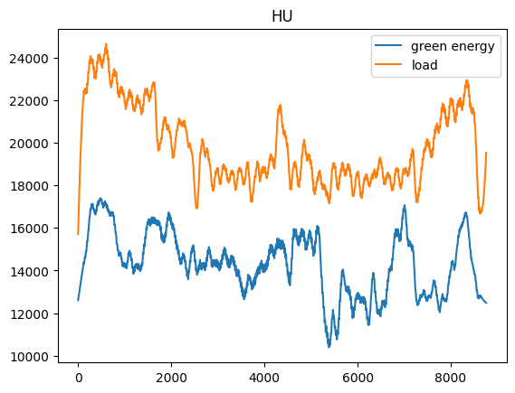
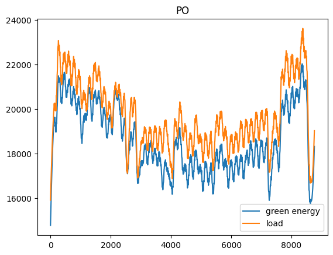
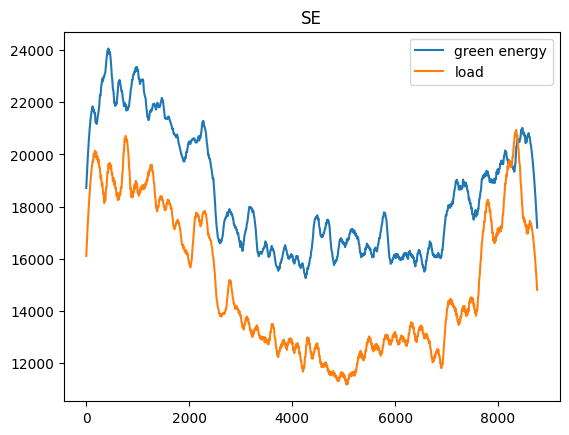
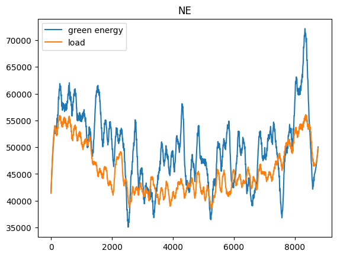
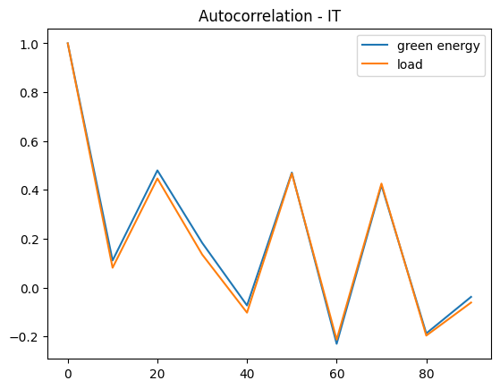
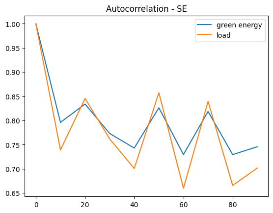

# Data Anlysis

Exploring the data can reveal key information that can aid in the design of the machine learning model.

code can be found in: [notebook](./src/data_analysis.ipynb)

## Facts

### Patterns

We can visualize the general trends in the data my looking at the smoothed version date to get rid of the noise and see the underlyng patterns.

We see that on an absolute scale, some countries are far behind on meeting their energy consumption requirements soley by green energy sources. Eg. Hungary, Poland

While others seem to do a far better job. Eg: Sweden, Netherlands, Spain

Thus we can expect the model to favour these countries.

### Autocorrelation

The autocorrelation of a signal is simply the correlation of the signal with a lagged copy of itself.
For a timeseries data, the metric can be useful to select a window for analysis, for instance the time window for a LSTM model.

The correlation appears to drop significantly until a lag of 10 and there appears to be some form of periodicity after that (which might be redundant). Thus, we can choose a window of size 10-15. Since the data is seperated by 1 hr interval, this makes sense, as we can expect the energy patterns to be quite similar every day (~24 hrs).

## Data Processing

The ingested dataset was observed to have missing values. But since the precision of measurement is 15 mins, we can expect the real-world values to be quite similar in the window, a nearest neighbour or linear interpolation was observed to be sufficient.

## Scaling

The data was normally scaled individually, i.e. apply $z = \frac{x - \mu}{\sigma}$ to each column to standardize it and the reverse mapping $x = z * \sigma + \mu$ to get back the absolute units (from the model prediciotns).

## Anomalies

Statistical methods can be applied to handle anomalies (like robust scaling), but as the approach considered is a deep LSTM model we can expect the model to learn to ignore the anomalies and focus on the trends.