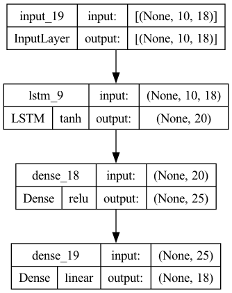
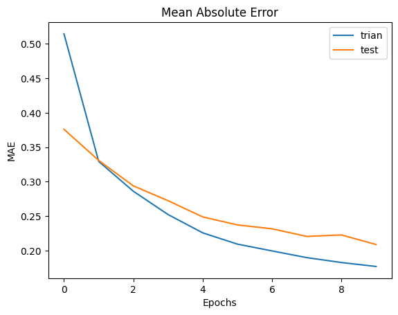

# Machine Learning

## ML Problem Formulation

Although, the problem statement given requires predicting 1 of 9 countries with the most surplus of green energy, the problem is formulated a bit differently here. Instead of looking it at as a classification problem, which can have many restricted, eg: what if we start modeling a new country?
Instead, the primary objective is accurately forecst the data, i.e. learn to predict the hourly green energy production and hourly consumption for each country using the past data. Then, we just compute the surplus and look at the maximum absolute value (MAW) to make the prediction. This way, the model is scalable to new countries.

## Motivation for Model Selection

Timeseries data can be analyzed in plenty of ways, traditional statistical models like ARMAX, ARMA, or neural networks, or recurrent neural networks. As recurrent neural networks, specifically LSTMs are capable of capturing long range patterns in the data, making them an ideal choice.

## Architectures

### Arch 1 - LSTM

Training Performance

